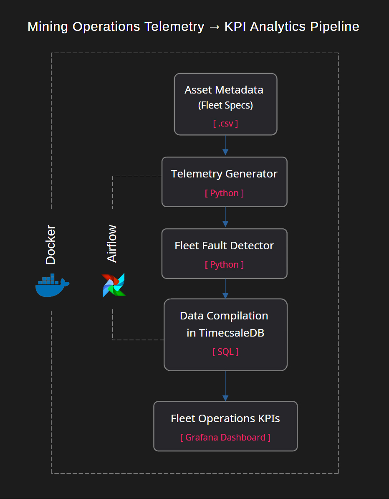
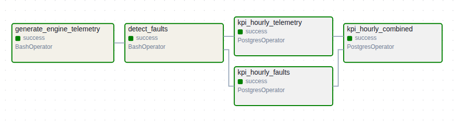
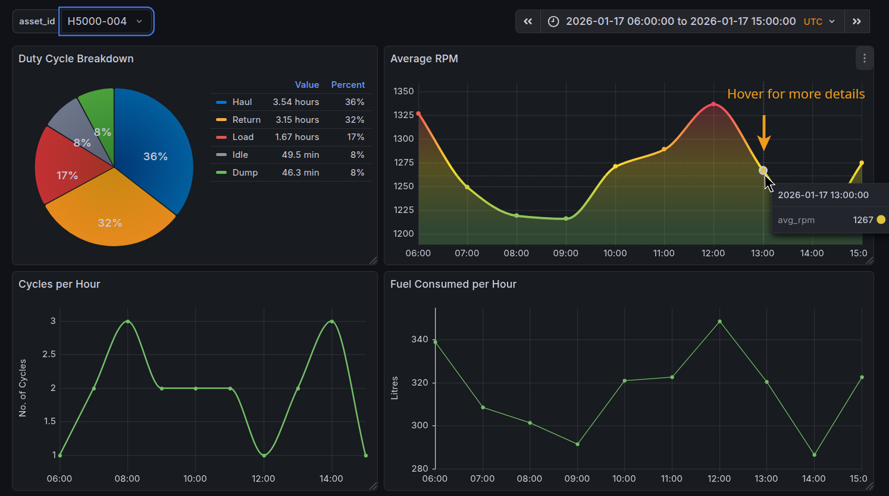
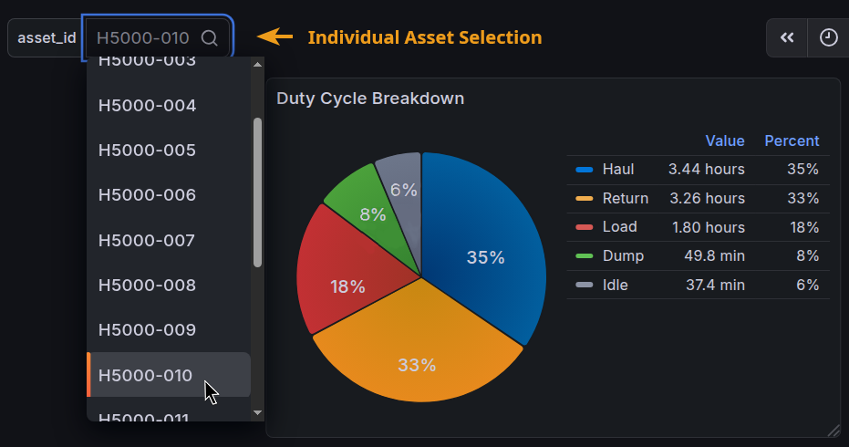
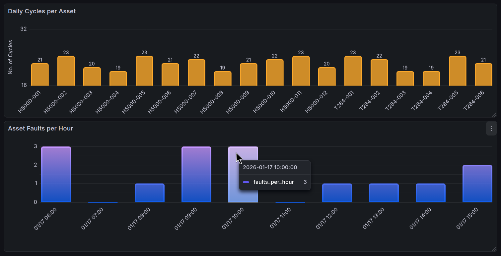

# Mining Operations Analytics Pipeline

**Data Engineer | Mining Operations Analytics**

This project demonstrates how mining operational data can be transformed into **actionable KPIs** using a **production-style data engineering pipeline**.

It is designed as a **client-facing demonstration** showing how raw equipment telemetry can be ingested, processed, aggregated, and visualised to support operational decision-making across mining operations.

---

## ⛏️ What This Demonstrates (For Mining Teams)

Mining operations generate vast volumes of time-series data — but value is only created when that data is **structured, contextualised, and made decision-ready**.

This project shows how a modern analytics stack can be used to:

- Track **equipment utilisation and duty cycles**
- Compare **asset-level performance** across a fleet
- Monitor **operational intensity** (cycles, runtime, fuel usage)
- Identify **fault patterns and reliability signals**
- Deliver **adjustable, scheduled dashboard** for operations and maintenance teams

The architecture mirrors production-style deployments and is scaled for local demonstration and reproducibility, while reflecting real-world patterns.

---

## 🧱 Architecture Overview

**Pipeline flow:**

Synthetic Telemetry
↓
TimescaleDB (Raw Telemetry)
↓
Fault Detection Layer
↓
Hourly KPI Aggregations
↓
Combined KPI Layer
↓
Grafana Dashboards

**Orchestration:** Apache Airflow
**Storage:** TimescaleDB (PostgreSQL)
**Visualisation:** Grafana
**Deployment:** Docker Compose

---

## 🛠 Technology Choices (Why These Tools)

| Component | Reason |
|--------|-------|
| **Python** | Handles telemetry ingestion, data preprocessing, and task orchestration within the pipeline |
| **TimescaleDB** | Optimized for high-frequency industrial time-series data |
| **Airflow** | Explicit, observable orchestration suitable for production pipelines |
| **Grafana** | Industry-standard operational dashboards |
| **Docker Compose** | Reproducible local environments for demos and prototyping |
| **PostgreSQL** | Widely adopted, enterprise-proven foundation |

These choices reflect tools commonly encountered in **modern mining analytics stacks**, not experimental or academic technologies.

---

## 📂 Project Structure

```text
mining_fleet_telemetry/
├── airflow_dags/
│   └── fleet_pipeline_dag.py
├── data/
│   └── asset_metadata.csv
├── docs/
│   ├── images/
│   │   ├── fleet_pipeline_flowchart.jpg
│   │   ├── airflow_dag_graph.png
│   │   ├── grafana_asset_overview.png
│   │   ├── grafana_duty_cycle.png
│   │   └── grafana_fleet-wide_performance.png
│   └── dashboards/
│       └── grafana_fleet_operations_dashboard.json
├── scripts/
│   ├── telemetry_df_generate.py
│   ├── fault_detector.py
│   └── sql/
│       ├── kpi_hourly_engine_agg.sql
│       ├── kpi_hourly_faults_agg.sql
│       └── kpi_hourly_combined.sql
├── logs/                  # Runtime logs (gitignored)
├── plugins/               # Reserved for Airflow extensions
├── LICENCE
├── docker-compose.yml
├── .env.example
├── .gitignore
└── README.md
```

---

## ⚙️ Pipeline Stages

### 1️⃣ Telemetry Generation
- Simulates realistic mining equipment telemetry
- Variable duty cycles, operational intensity, and shift behavior
- Asset-level variation preserved across a full shift window

### 2️⃣ Fault Detection
- Applies rule-based thresholds reflecting industry-style fault logic
- Produces discrete fault events per asset and hour

### 3️⃣ Hourly KPI Aggregation
- Engine performance
- Duty cycle breakdown
- Fuel consumption estimates
- Cycle counts

### 4️⃣ Combined KPI Layer
- Merges telemetry KPIs and fault KPIs into a **dashboard-ready dataset**

### 5️⃣ Visualisation
- Asset-selectable dashboards
- Fleet-wide comparisons
- Hourly operational views

---

## 📊 Example Dashboards (Grafana)

This project includes an example Grafana dashboard that visualises the KPI-ready dataset produced by the pipeline.

Dashboards include:
- **Average RPM per Hour** (per asset)
- **Duty Cycle Breakdown**
- **Cycles per Hour**
- **Fleet-wide Daily Cycle Comparison**
- **Fault Events per Hour**

The dashboard is intentionally designed to reflect **real operational questions**, rather than generic charting.

---

### 🔄 End-to-End Data Flow



_Airflow acts as the orchestration layer, coordinating Python-based telemetry generation, fault detection, and SQL-based KPI aggregation against TimescaleDB. Grafana reads directly from the database to visualize operational metrics._

---

### 🧩 Orchestration with Airflow

Apache Airflow is used to orchestrate the entire pipeline, ensuring each step executes in the correct order and dependencies are enforced. The DAG is designed for clarity and traceability, with each task representing a discrete operational concern.



*Airflow DAG execution graph showing the hourly fleet telemetry pipeline. Each task represents a discrete step in the ETL process: generating raw telemetry, detecting faults, computing hourly KPIs, and combining results. Green indicates successful execution.*

---

## 📈 Operational Analytics Dashboard (Grafana)

Grafana is used as the visualisation layer, reading directly from TimescaleDB to surface both asset-level and fleet-wide operational KPIs. The dashboard is designed to support day-to-day operational monitoring as well as higher-level performance comparison across assets.

### Asset-Level Operational Overview



*Asset-level operational KPIs with dynamic asset selection. This view enables operators to analyse utilisation, duty cycle distribution, fuel usage, and operating intensity for individual assets.*

### Duty Cycle Breakdown



*Duty cycle breakdown for a selected asset, showing how operating time is distributed across idle, load, haul, dump, and return states.*

### Fleet-Wide Performance Comparison



*Fleet-wide comparison of daily completed cycles per asset, enabling rapid identification of performance variation across the fleet.*

---

## 📥 Dashboard Import (Client-Friendly)

A prebuilt Grafana dashboard is provided as a JSON export:

```text
dashboards/
└── grafana_fleet_operations_dashboard.json
```

To load the dashboard:

1. Open **Grafana** → **Dashboards** → **Import**
2. Upload `grafana_fleet_operations_dashboard.json`
3. Select the existing **TimescaleDB** data source
4. Click **Import**

The dashboard will immediately populate once the Airflow pipeline has run successfully.

> In production deployments, this dashboard import step can be automated as part of container provisioning.
> For this demonstration, the manual import keeps the deployment simple and transparent.

---

### 📌 Notes on Visualisation Scope

Grafana is included here to demonstrate **end-to-end delivery** — from raw telemetry to decision-ready insights.

In real client engagements, visualisation can be:

- Extended
- Re-skinned
- Integrated with existing BI tooling
- Or omitted entirely if the database serves downstream analytics teams

This flexibility reflects real-world mining analytics workflows.

---

## ▶️ Running the Project Locally

### Prerequisites
- Docker & Docker Compose
- Git

### Steps

```bash
git clone <repo-url>
cd mining_fleet_telemetry

cp .env.example .env
docker compose up -d
```

Then:

- Open **Airflow** → [http://localhost:8080](http://localhost:8080) 
- Trigger the DAG: `fleet_telemetry_pipeline` 
- Open **Grafana** → [http://localhost:3000](http://localhost:3000) 

---

### 🎯 Intended Use

This repository is intentionally designed as:

- A **demonstration of engineering capability**
- A **conversation starter** with mining teams
- A **foundation** that can be adapted to real operational data

It is **not a toy example** — the patterns shown here translate directly to production mining environments.

---

### 👤 About

Built by a **Data Engineer specialising in Mining Operations Analytics**, focused on:

- Operational visibility 
- Scalable data pipelines 
- Business-aligned analytics for resource industries 

📫 *For collaboration or client work, connect via LinkedIn.*
[LinkedIn](https://www.linkedin.com/in/aaron-mietzel/)

---

### 🚧 Disclaimer

All data is **non-proprietary** and generated for demonstration purposes.

---
